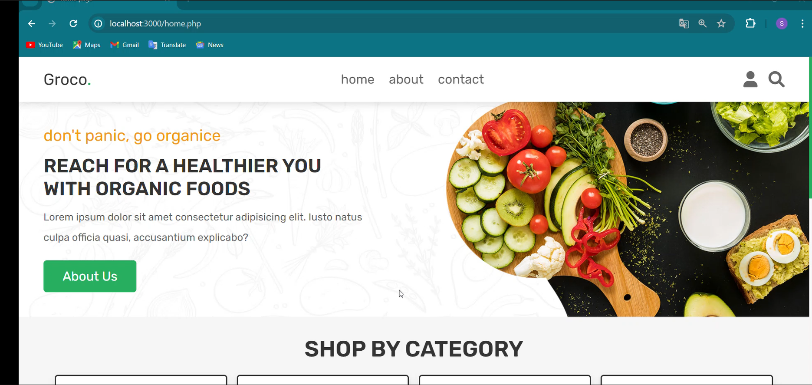
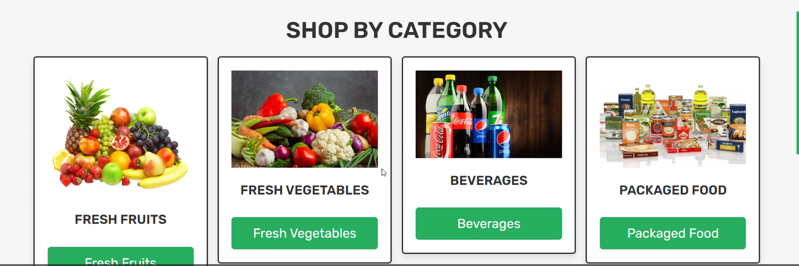
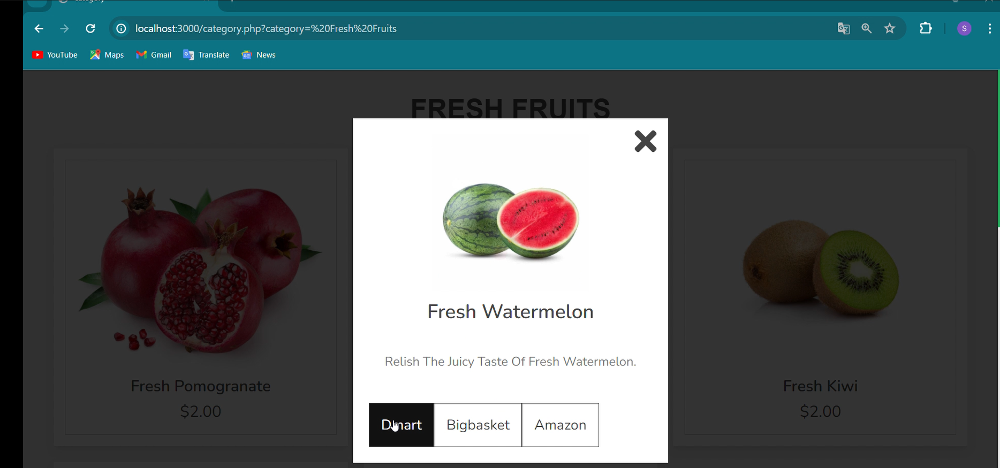

# Groco. 🛒

A grocery price comparison web platform that fetches and compares live product prices across **Amazon**, **BigBasket**, and **Dmart** — helping users find the best deal instantly.

Built as a final year Diploma project (2024).

---
### Screenshots






## 🔍 Features

- Compare grocery prices across Amazon, BigBasket, and Dmart
- Categories: Fresh Fruits, Fresh Vegetables, Beverages, Packaged Food
- User registration, login, and session management
- Add to cart, wishlist, and order management
- Admin dashboard for product and user management
- Selenium-based scraper to fetch live prices into the database

---

## 🛠️ Tech Stack

| Layer | Technology |
|-------|------------|
| Frontend | HTML, CSS, JavaScript |
| Backend | PHP |
| Database | MySQL |
| Scraper | Java, Selenium WebDriver |

---

## ⚙️ Setup Instructions

### Prerequisites
- XAMPP (PHP + MySQL)
- Browser

### Steps

1. Clone the repository
```bash
   git clone https://github.com/Seja0308/groco.git
```

2. Copy project folder into `htdocs` inside your XAMPP installation

3. Import the database
   - Open `phpMyAdmin`
   - Create a new database called `shop_db`
   - Import `shop_db.sql`

4. Configure environment
   - Rename `.env.example` to `.env`
   - Update values if needed (default XAMPP settings work as-is)

5. Start Apache and MySQL in XAMPP

6. Visit `http://localhost/groco/home.php`

---

## 📁 Project Structure
groco/
├── home.php
├── config.php
├── shop.php
├── category.php
├── cart.php
├── admin_page.php
├── webscrap/
│   └── WebScraping/
│       └── src/CapturePrices.java
├── shop_db.sql
├── .env.example
└── README.md

---

## ⚠️ Note

`.env` file is excluded from this repository.
Copy `.env.example` and rename it to `.env` for local setup.

---

## 👩‍💻 Developer

**Sejal Marawade** — [LinkedIn](https://www.linkedin.com/in/sejalmarawade0308) · [GitHub](https://github.com/Seja0308)